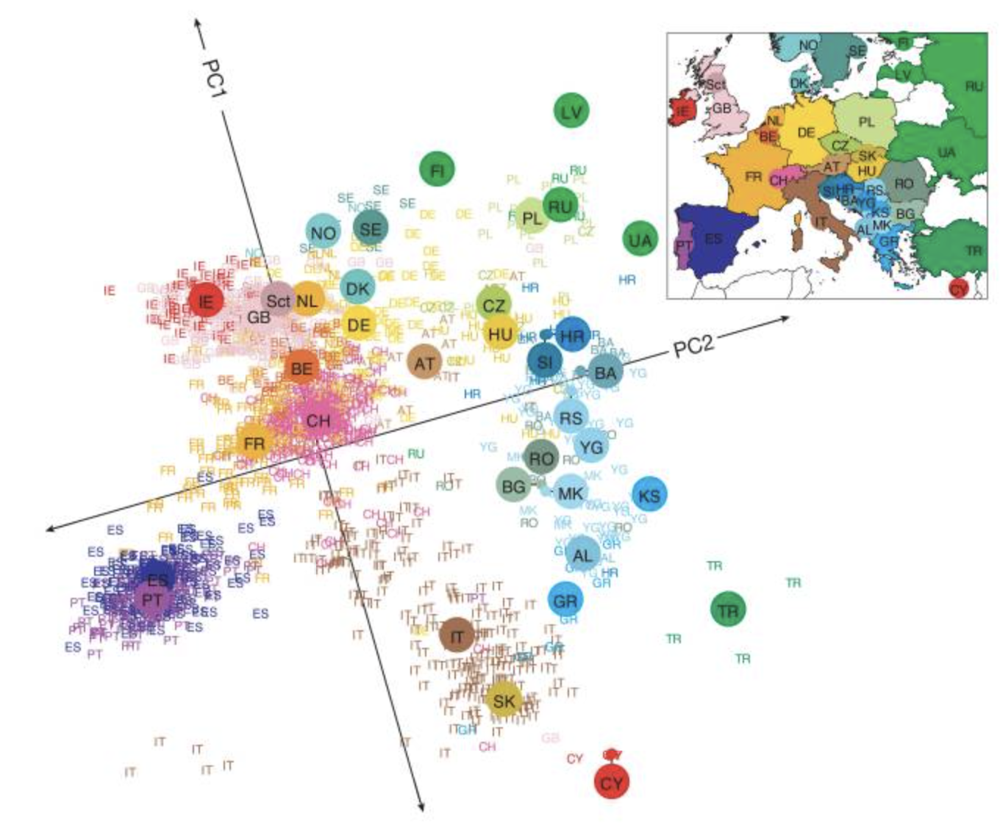
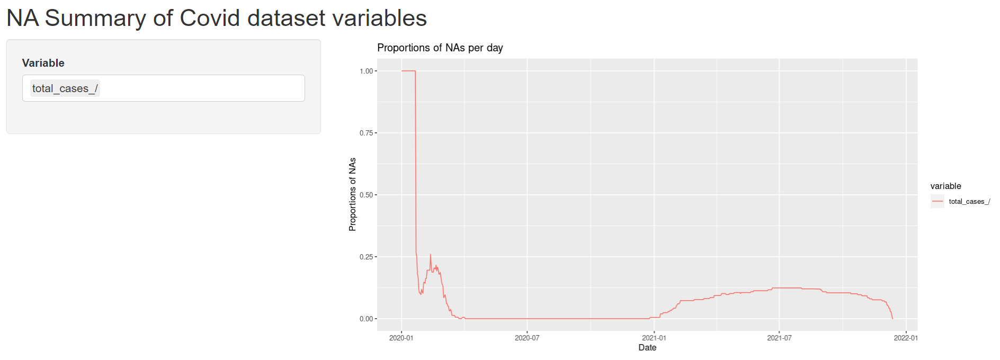

```{r setup, include=FALSE}
knitr::opts_chunk$set(echo = TRUE, message=FALSE, warning=FALSE, cache=TRUE, fig.align = "center")
library(gapminder)
library(dplyr)
library(tidyverse)
library(tidymodels)
library(lubridate)
library(GGally)
library(gganimate)
library(gapminder)
library(tidytext)
```

# Motivation

* Explore whether covid data is telling of
  + geography (area, country, continent)
  + country policies
  + any other commonalities between countries in the same cluster (based on COVID-19 data)
* Main Learning/Computational Methods
  + Principal Component Analysis (PCA)
  + Clustering
* Inspiration: Genes mirror geography within Europe (Novembre et al.)

<p align="center">
  
</p>

---

# Datasets

* Primary Dataset
  + Our World in Data (owid) COVID-19 dataset
  
* Supporting Datasets
  + World Bank Open Data
  + World Map and Coordinates
  + gapminder dataset in R

---

# Our World in Data (owid) COVID-19 dataset

* 130,000+ observations, 67 variables
  + 237 locations (countries, continents, world)

* Significant Variables
  + confirmed cases
  + comfirmed deaths
  + excess mortality
  + hospitalizations and intensive care unit statistics
  + policy responses
  + covid tests and test positivity
  + vaccinations numbers
  + country specific development indices
  
---

# Our World in Data (owid) COVID-19 dataset
  
* Relevant variables gets updated daily (live data)

* Data synthesized from many reputable sources such as:
  + Johns Hopkins University's COVID-19 Data Repository by the Center for Systems Science and Engineering (CSSE)
  + European Centre for Disease Prevention and Control (ECDC)
  + Official National Reports
  + United Nations
  + World Bank
  + Global Burden of Disease

---

# EDA - New Cases

```{r, echo=FALSE}
filter_continents <- function(covid_data) {
   covid_data <- covid_data %>%
     filter(continent == "Asia" |
           continent == "Africa" |
           continent == "Europe" |
           continent == "North America" |
           continent == "Oceania" |
           continent == "South America" |
           continent == "Antarctica"
           )
}

filter_world <- function(covid_data) {
  covid_data <- covid_data %>%
    filter(location != "World" |
           location != "Asia" |
           location != "Africa" |
           location != "Europe" |
           location != "North America" |
           location != "Oceania" |
           location != "South America" |
           location != "Antarctica"
           )
}

# replace NA's with 0s
replace_all_na <- function(covid_data) {
  covid_data %>%
    replace(is.na(.), 0)
}


covid <- read.csv("https://raw.githubusercontent.com/owid/covid-19-data/master/public/data/owid-covid-data.csv")

# change date to date variable
covid <- covid %>%
  mutate(date = as.Date(date)) %>%
  filter_world %>%
  filter_continents %>%
  filter(date < as.Date("2021-12-10"))


# latitude longitude dataset 

lats_long <- read.csv("https://raw.githubusercontent.com/albertyw/avenews/master/old/data/average-latitude-longitude-countries.csv")

lats_long <- lats_long %>%
  rename(location = Country)

covid <- left_join(covid, lats_long, by = "location")
world <- map_data("world")
```

```{r, echo=FALSE}
covid %>%
  replace_all_na() %>%
  ggplot(aes(x = date, y = new_cases_smoothed_per_million, color=location)) +
  geom_line(aes(color = location), show.legend = FALSE) +
  facet_wrap(~continent) +
  scale_colour_manual(values = country_colors) +
  labs(title = "New Cases (Smoothed*) per Day Over the COVID-19 Pandemic",
       caption = "*smoothed means averaged out when figures aren't reported daily") +
  theme(axis.text.x = element_text(angle = 90, vjust = 0.5, hjust=1))
```

---

# EDA - Vaccinations

```{r, echo=FALSE}
covid %>%
  replace_all_na %>%
  ggplot(aes(x = date, y = new_vaccinations_smoothed_per_million, color=location)) +
  geom_line(aes(color = location), show.legend = FALSE) +
  facet_wrap(~continent) +
  scale_colour_manual(values = country_colors) +
  labs(title = "New Vaccinations (smoothed*) per Day Over the COVID-19 Pandemic",
       caption = "*smoothed means averaged out when figures aren't reported daily",
       y = "new vaccinations (smoothed*) per million") +
  theme(axis.text.x = element_text(angle = 90, vjust = 0.5, hjust=1))
```

---

### Total Cases vs Total Deaths Over Time by Continent

```{r, echo=FALSE}
case_death_anim <- covid %>%
  replace_all_na() %>%
  filter_continents() %>%
  ggplot(aes(total_cases_per_million, total_deaths_per_million, color = location, size=population)) +
  geom_point(alpha = 0.7, show.legend = FALSE) +
  scale_color_manual(values = country_colors) +
  scale_size(range = c(2, 12)) +
  facet_wrap(~continent) +
  labs(title = 'Date: {frame_time}', x = 'Total Cases per Million', y = 'New Deaths per Million') +
  transition_time(date) +
  ease_aes('linear') +
  theme(axis.text.x = element_text(angle = 90, vjust = 0.5))

animate(case_death_anim, duration = 10)
```

---

### Relationship Between Total Cases and Total Deaths Over Time (Static Summary)

```{r, echo=FALSE}
covid %>%
  replace_all_na() %>%
  filter_continents() %>%
  ggplot(aes(total_cases_per_million, total_deaths_per_million, color = location, size = population)) +
  geom_smooth(size=0.5, se=FALSE, show.legend=FALSE) +
  facet_wrap(~continent) +
  scale_color_manual(values = country_colors) +
  theme(axis.text.x = element_text(angle = 90, vjust = 0.5)) +
  labs(title = "",
       y = "total deaths per million", x = "total cases per million")
```

---

### Total Cases Over Time by Country

```{r, echo=FALSE}
anim_map_total_cases <- ggplot() +
  geom_map(
    data = world, map = world,
    aes(long, lat, map_id = region),
    color = "black", fill = "lightgray", size = 0.01
  ) +
  geom_point(data = covid, aes(Longitude, Latitude, color=location, size=total_cases), show.legend = FALSE) +
  scale_color_manual(values = country_colors) +
  scale_size(range = c(1, 15)) +
  transition_time(date) +
  labs(x = "", y = "") +
  scale_x_discrete(labels=NULL, breaks=NULL) +
  scale_y_discrete(labels=NULL, breaks=NULL)

animate(anim_map_total_cases, duration=10)
```

---

### Current Total Cases by Country

```{r, echo=FALSE}
map <- ggplot() +
  geom_map(
    data = world, map = world,
    aes(long, lat, map_id = region),
    color = "black", fill = "lightgray", size = 0.01
  ) +
  geom_point(data = covid, aes(Longitude, Latitude, color=location, size=total_cases), show.legend = FALSE) +
  scale_color_manual(values = country_colors) +
  scale_size(range = c(1, 15)) +
  labs(title = "", x = "", y = "") +
  scale_x_discrete(labels=NULL, breaks=NULL) +
  scale_y_discrete(labels=NULL, breaks=NULL)
  
map
```

---

### Data Missingness 

```{r, echo=FALSE}
vars <- names(covid)

vars <- vars[! vars %in% c('date')]

len_per_day <- covid %>% group_by(date) %>%
  summarise(across(vars, length))

lengthsummary <- len_per_day %>% 
  pivot_longer(!date, names_to="variable") %>%
  mutate(date=ymd(date))

lengthsummary %>% filter(grepl('cases', variable)) %>% ggplot() + geom_line(aes(x=date, y=value, color=variable), show.legend = FALSE) + ylab("no. of countries reported") + ggtitle("No. of countries reporting data over time")
```

---

### Data Missingness 

```{r, echo = FALSE}
prop <- covid %>% group_by(date) %>% 
  summarise(across(vars, funs(sum(is.na(.)) / length(.))))

NAsummary <- prop %>% 
  pivot_longer(!date, names_to="variable") %>%
  mutate(date=ymd(date))

NAsummary %>% filter(grepl('vaccination', variable)) %>% ggplot() + geom_line(aes(x=date, y=value, color=variable)) +geom_vline(xintercept=ymd("2020-12-11"))  + geom_text(aes(x = ymd("2020-6-10"), y = 0.5, label = "Pfizer vaccine approved")) + ggtitle("Proportion of missing vaccination data over time")
```

---

# Data Missingness Shiny App



Link to Shiny App: https://arm-wong.shinyapps.io/NAsummary/

---

# Why PCA? What is PCA?

* Principal Component Analysis
* Often used with large datasets with numeric variables
* Reduce dimensionality
  + combine and synthesize variables into less "components"
  + Variables -> Pincipal Components (linear combinations of variables)
* Increase convenience in model building
* Maximize variance (minimize information loss)

- Shortcomings
  + Difficult to interpret what these PCs actually mean
  + Can only 'get a sense' of how variables contribute to models

---

### PCA Results for 2021-12-05

```{r, echo=FALSE}
bad_cols <- c("excess_mortality_cumulative", "excess_mortality", "excess_mortality_cumulative_per_million", "excess_mortality_cumulative_absolute", "reproduction_rate", "total_boosters", "total_boosters_per_hundred", "weekly_icu_admissions", "weekly_icu_admissions_per_million", "weekly_hosp_admissions", "weekly_hosp_admissions_per_million", "tests_units")

one_day <- covid %>% filter(date == "2021-12-05")

one_day_prepped <- replace_all_na(one_day) %>%
  filter_continents() 

ready <- one_day_prepped %>% select(!bad_cols)

pca_recipe <- recipe(~., data = ready) %>%
  step_center(all_numeric()) %>%
  step_scale(all_numeric()) %>%
  step_pca(all_numeric(), id = "pca")

pca_estimates <- prep(pca_recipe)

tidy_pca_loadings <- pca_estimates%>% 
  tidy(id = "pca")

tidy_pca_loadings %>%
  filter(component %in% paste0("PC", 1:5)) %>%
  mutate(component = fct_inorder(component)) %>%
  ggplot(aes(value, terms, fill = terms)) +
  geom_col(show.legend = FALSE) +
  facet_wrap(~component, nrow = 1) +
  labs(y = NULL) +
  theme(text = element_text(size = 7), axis.text.x = element_text(angle=90, hjust=1)) +
  labs(title = "Variables in Principal Components")
```

---

### Deep Dive into PC1 for 2021-12-05

```{r,echo=FALSE}
plot_loadings <- tidy_pca_loadings %>% 
  filter(component %in% c("PC1")) %>% 
  mutate(terms = tidytext::reorder_within(terms, 
                                          abs(value), 
                                          component)) %>% 
  ggplot(aes(abs(value), terms, fill = value>0)) +
  geom_col() +
  facet_wrap( ~component, scales = "free_y") +
  scale_y_reordered() + # appends ___ and then the facet at the end of each string
  scale_fill_manual(values = c("deepskyblue4", "darkorange")) +
  labs( x = "absolute value of contribution",
        y = NULL,
        fill = "Positive?",
        title = "Weights of Variables in PC1") +
  theme_minimal() + 
  theme(text = element_text(size = 7))

plot_loadings
```

---

### PCA - Lack of Correlation

```{r, echo=FALSE}
juice_df <- juice(pca_estimates)

juice_df %>%
  select(starts_with("PC"), continent) %>%
  ggpairs(aes(color = continent), colour = "cyl",
    upper = list(continuous = wrap("cor", size = 2)))
```

---

### Clustering Countries by PCA Variables

```{r, echo=FALSE}
set.seed(47)
pca_kclust <- juice_df %>%
  select(starts_with("PC")) %>%
  kmeans(centers=6)

loc_clusters <- pca_kclust %>% augment(juice_df)
long_lat_clusters <- left_join(loc_clusters, lats_long, by="location")

cluster_map <- ggplot() +
  geom_map(
    data = world, map = world,
    aes(long, lat, map_id = region),
    color = "black", fill = "lightgray", size = 0.01
  ) +
  geom_point(data = long_lat_clusters, aes(x=Longitude, y=Latitude, color=.cluster))+
  labs(title="", x="", y="", color="cluster") +
  scale_x_discrete(labels=NULL, breaks=NULL) +
  scale_y_discrete(labels=NULL, breaks=NULL)
  
cluster_map
```

---

# What if we did this for everyday?

```{r, echo=FALSE}
clean_covid <- covid %>%
  replace_all_na() %>%
  select(!bad_cols)

cleanest_covid <- clean_covid %>%
  filter(date > as.Date("2020-12-28"))

sorted_dates <- sort(unique(cleanest_covid$date))
#length(sorted_dates)

first_day_df <- clean_covid %>% filter(date == as.Date("2020-12-28"))
#first_day_df %>%
#  group_by(date)  %>%
#  summarise_all(sd)

# function to perform PCA and cluster based and colors!
get_cluster_colored_df <- function(day_df) {
  pca_recipe <- recipe(~., data=day_df) %>%
    step_center(all_numeric()) %>%
    step_scale(all_numeric()) %>%
    step_pca(all_numeric(), id="pca")
  
  pca_estimates <- prep(pca_recipe)
  juice_df <- juice(pca_estimates)
  
  pca_kclust <- juice_df %>%
    select(starts_with("PC")) %>%
    kmeans(centers=6)
  
  loc_clusters <- pca_kclust %>% 
    augment(juice_df)
  
  us_row <- loc_clusters %>%
    dplyr::filter(location == "United States")
  us_clust = us_row$.cluster
  
  car_row <- loc_clusters %>%
    dplyr::filter(location == "Central African Republic")
  car_clust = car_row$.cluster
  
  ger_row <- loc_clusters %>%
    dplyr::filter(location == "Germany") 
  ger_clust = ger_row$.cluster
  
  ;costa_row <- loc_clusters %>%
    dplyr::filter(location == "Costa Rica")
  costa_clust = costa_row$.cluster
  
  remaining_clusts <- setdiff(as.factor(seq(1,6)), c(us_clust, car_clust, ger_clust, costa_clust))
  
  loc_clusters <- loc_clusters %>%
    mutate(my_color = ifelse(.cluster == us_clust, "red", "orange1")) %>%
    mutate(my_color = ifelse(.cluster == costa_clust, "springgreen3", my_color)) %>%
    mutate(my_color = ifelse(.cluster == remaining_clusts[1], "purple3", my_color)) %>%
        mutate(my_color =  ifelse(.cluster == ger_clust, "orchid2", my_color)) %>%
        mutate(my_color = ifelse(.cluster == car_clust, "steelblue2", my_color))
  
  return(loc_clusters)
}

# the first date
all_loc_clusters <- get_cluster_colored_df(first_day_df)

# the rest of the dates
for (day in sorted_dates){
  day_data <- cleanest_covid %>%
    filter(date == day)
  
  loc_clusters <- get_cluster_colored_df(day_data)
  all_loc_clusters <- rbind(all_loc_clusters, loc_clusters)
}

#all_long_lat_clusters <- left_join(all_loc_clusters, lats_long, by="location")
all_long_lat_clusters <- right_join(lats_long, all_loc_clusters, by="location")
map_anim <- ggplot() +
  geom_map(
    data = world, map = world,
    aes(long, lat, map_id = region),
    color = "black", fill = "lightgray", size = 0.01
  ) +
  geom_point(data = all_long_lat_clusters, aes(x=Longitude, y=Latitude, color=my_color)) +
  transition_time(date) +
  scale_x_discrete(labels=NULL, breaks=NULL) +
  scale_y_discrete(labels=NULL, breaks=NULL) +
  scale_color_manual(labels=c("1", "2", "3", "4", "5", "6"), values=c("orange1", "orchid2", "purple3", "red", "springgreen3", "steelblue2")) +
  labs(title = 'Date: {frame_time}', x="", y="", color="cluster")

animate(map_anim, duration = 20)
```

---

# What if we only took scaled variables (per)

```{r, echo=FALSE}
cleaner_covid_2 <- covid %>%
  replace_all_na() %>%
  select(contains("per"), c(continent, location, date, aged_65_older, aged_70_older, gdp_per_capita, extreme_poverty, cardiovasc_death_rate, diabetes_prevalence, female_smokers, male_smokers, handwashing_facilities, hospital_beds_per_thousand, life_expectancy, human_development_index)) %>%
  select(!c(excess_mortality_cumulative_per_million, total_boosters_per_hundred, weekly_icu_admissions_per_million, weekly_hosp_admissions_per_million))
cleanest_covid_2 <- cleaner_covid_2 %>%
  dplyr::filter(date > as.Date("2020-12-28")) %>%
  dplyr::filter(date < as.Date("2021-12-10"))

get_cluster_colored_df2 <- function(day_df) {
  pca_recipe <- recipe(~., data=day_df) %>%
    step_center(all_numeric()) %>%
    step_scale(all_numeric()) %>%
    step_pca(all_numeric(), id="pca")
  
  pca_estimates <- prep(pca_recipe)
  juice_df <- juice(pca_estimates)
  
  pca_kclust <- juice_df %>%
    select(starts_with("PC")) %>%
    kmeans(centers=6)
  
  loc_clusters <- pca_kclust %>% 
    augment(juice_df)
  
  tunisia_row <- loc_clusters %>%
    dplyr::filter(location == "Tunisia")
  tunisia_clust = tunisia_row$.cluster
  
  car_row <- loc_clusters %>%
    dplyr::filter(location == "Central African Republic")
  car_clust = car_row$.cluster
  
  ger_row <- loc_clusters %>%
    dplyr::filter(location == "Germany") 
  ger_clust = ger_row$.cluster
  
  uae_row <- loc_clusters %>%
    dplyr::filter(location == "United Arab Emirates")
  uae_clust = uae_row$.cluster
  
  remaining_clusts <- setdiff(as.factor(seq(1,6)), c(tunisia_clust, car_clust, ger_clust, uae_clust))
  
  loc_clusters <- loc_clusters %>%
    mutate(my_color = ifelse(.cluster == remaining_clusts[1], "red", "orange1")) %>%
    mutate(my_color = ifelse(.cluster == uae_clust, "purple3", my_color)) %>%
        mutate(my_color = ifelse(.cluster == tunisia_clust, "springgreen3", my_color)) %>%
        mutate(my_color =  ifelse(.cluster == ger_clust, "orchid2", my_color)) %>%
        mutate(my_color = ifelse(.cluster == car_clust, "steelblue2", my_color))
  
  return(loc_clusters)
}

first_day_df2 <- cleaner_covid_2 %>% dplyr::filter(date == as.Date("2020-12-28"))
all_loc_clusters_colored2 <- get_cluster_colored_df2(first_day_df2)

# the rest of the dates
for (day in sorted_dates){
  day_data <- cleaner_covid_2 %>%
    dplyr::filter(date == day)
  
  loc_clusters <- get_cluster_colored_df2(day_data)
  all_loc_clusters_colored2 <- rbind(all_loc_clusters_colored2, loc_clusters)
}

all_long_lat_clusters_colored2 <- left_join(all_loc_clusters_colored2, lats_long, by="location")

map_anim_colored2 <- ggplot() +
  geom_map(
    data = world, map = world,
    aes(long, lat, map_id = region),
    color = "black", fill = "lightgray", size = 0.01
  ) +
  geom_point(data = all_long_lat_clusters_colored2, aes(x=Longitude, y=Latitude, color=my_color)) +
  transition_time(date) +
  scale_x_discrete(labels=NULL, breaks=NULL) +
  scale_y_discrete(labels=NULL, breaks=NULL) +
  scale_color_manual(labels=c("1", "2", "3", "4", "5", "6"), values=c("orange1", "orchid2", "purple3", "red", "springgreen3", "steelblue2")) +
  labs(title = 'Date: {frame_time}', x="", y="", color="cluster")

animate(map_anim_colored2, duration = 20)
```

---

# Extensions - World Bank Data

* Can we learn more about these clusters?
* Know countries in clusters are similar in some ways.

* But how?
  + Look at Principal Components
  + Look at other indicators (World Bank Data)
  
---

### Human Development Index (HDI) and Total Cases per Million

```{r, echo=FALSE}
covid_latest <- covid %>%
  filter(date == as.Date("2021-12-9"))

# data
HDI_2020 <- read.csv("https://raw.githubusercontent.com/ST47S-CompStats-Fall2021/GroupJ-COVID/main/data/World_Bank_2020_HDI.csv?token=AST7DENLAE4GMLQOXQFKHRTBYFBBU", fileEncoding="UTF-8-BOM")
HDI_2020 <- HDI_2020 %>%
  rename(location = Country.Name) %>%
  rename(HDI = X2020)
covid_latest_hdi <- left_join(covid_latest, HDI_2020, by = "location")
covid_latest_hdi <- covid_latest_hdi %>%
  filter(!is.na(HDI)) %>%
  arrange(desc(HDI))
covid_hdi <- left_join(covid, HDI_2020, by = "location") %>%
  filter(!is.na(HDI))

covid_latest_hdi %>%
  ggplot(aes(x = HDI, y = total_cases_per_million)) +
  geom_point(aes(color = continent)) +
  labs(y = "total cases per million") +
  geom_smooth(se = FALSE)
```

---

### HDI and Total Cases Over Time

```{r, echo=FALSE}
hdi_animate <- ggplot(covid_hdi, aes(HDI, total_cases_per_million, color = location)) +
  geom_point(alpha = 0.7, show.legend = FALSE) +
  scale_color_manual(values = country_colors) +
  scale_size(range = c(2, 12)) +
  facet_wrap(~continent) +
  labs(title = 'Date: {frame_time}', x = 'HDI', y = 'total cases per million') +
  transition_time(date) +
  ease_aes('linear') +
  theme(axis.text.x = element_text(angle = 90, vjust = 0.5))
animate(hdi_animate, duration = 10)
```

---

### HDI and Total Cases (Static Summary)

```{r, echo=FALSE}
covid_latest_hdi %>%
  ggplot(aes(x = HDI, y = total_cases_per_million)) +
  geom_point(aes(color=location), show.legend = FALSE) +
  scale_color_manual(values = country_colors) +
  labs(y = "total cases per million") +
  facet_wrap(~continent) +
  geom_smooth(method = "lm", se = FALSE)
```
---

### Tourism as measured by International Arrivals (2019)

```{r, echo=FALSE}
# data
inter_arrivals <- read.csv("https://raw.githubusercontent.com/ST47S-CompStats-Fall2021/GroupJ-COVID/main/data/World_Bank_International_Arrival.csv?token=AST7DEIUKOA6UO5AO6ETDVDBXO4M2", fileEncoding="UTF-8-BOM")
IA_2019 <- inter_arrivals %>%
  rename(location = Country.Name) %>%
  rename(inter_arrivals = X2019) %>%
  select(location, inter_arrivals)
covid_IA <- left_join(covid, IA_2019, by = "location")
covid_IA <- covid_IA %>%
  filter(date == max(date)) %>%
  filter(!is.na(inter_arrivals)) %>%
  arrange(desc(inter_arrivals))

covid_IA %>%
  ggplot(aes(x = inter_arrivals, y = total_cases_per_million)) +
  geom_point(aes(color = continent)) +
  geom_smooth(se = FALSE) +
  labs(y="total cases per million")
```

---

### Tourism by Continent

```{r, echo=FALSE}
covid_IA %>%
  ggplot(aes(x = inter_arrivals, y = total_cases_per_million)) +
  geom_point(aes(color = continent), show.legend = FALSE) +
  facet_wrap(~continent, scales = "free") +
  theme(axis.text.x = element_text(angle = 90, vjust = 0.5, hjust=1)) +
  labs(x = "international arrivals", y = "total cases per million")
```

---

### GDP and Vaccination

```{r, echo=FALSE}
covid %>%
  filter(date == max(date)) %>%
  ggplot(aes(x = gdp_per_capita, y = total_vaccinations_per_hundred)) +
  geom_point(aes(color = continent)) +
  geom_smooth(method = "lm", se = FALSE) +
  facet_wrap(~continent) +
  labs(x="GDP per capita", y="total vaccinations per hundred")
```

---

# Closing Thoughts

* Covid mirrors geography (if you squint your eyes)

<p align="center">
  
</p>


